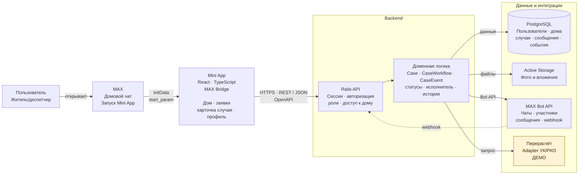

# Домочатцы

"Домочатцы" - мини-приложение для заявок жителей многоквартирных домов. Житель создаёт заявку и следит за её решением; диспетчер уточняет проблему, назначает исполнителя и фиксирует результат. Локальный стенд запускается с тестовым пользователем и данными. При входе через MAX приложение получает пользователя и доступ к домовым чатам через бота.

## Содержание

- [Основной сценарий](#основной-сценарий)
- [Состав и архитектура](#состав-и-архитектура)
- [Локальный запуск](#локальный-запуск)
- [Переменные окружения и порты](#переменные-окружения-и-порты)
- [Внешние сервисы и интеграции](#внешние-сервисы-и-интеграции)
- [Данные и тестовый набор](#данные-и-тестовый-набор)
- [Пошаговая проверка](#пошаговая-проверка)
- [Известные ограничения](#известные-ограничения)
- [Остановка и повторный запуск](#остановка-и-повторный-запуск)

## Основной сценарий

Ниже один полный путь заявки на примере холодной воды. В строках с пометкой "если" показаны альтернативные действия: они не выполняются все подряд. Статус указан так, как он виден в интерфейсе; в скобках - ключ API.

| № | Шаг | Ожидаемый результат |
| ---: | --- | --- |
| 1 | Житель открывает Mini App в MAX. Приложение передаёт серверу подписанные данные запуска, а сервер создаёт сессию пользователя. При локальном запуске житель открывает frontend в браузере. Используется тестовый аккаунт без MAX. | Открывается главная страница жителя. В MAX показывается его профиль; локально - демонстрационный пользователь. |
| 2 | Житель открывает профиль и выбирает дом. В MAX доступны дома из связанных с ботом чатов, к которым подтверждён доступ пользователя; в локальном стенде - демонстрационные дома. | Главная страница показывает адрес выбранного дома и ленту именно его заявок. Доступ к заявкам другого дома не предоставляется. |
| 3 | Житель просматривает ленту. Если сосед уже сообщил о той же проблеме и его заявка публичная, житель нажимает "У меня так же". Если подходящей заявки нет, переходит к созданию новой. | Подтверждение соседа увеличивает счётчик и появляется в "Подписках". Статус чужой заявки не меняется. Приватные заявки соседям не показываются. |
| 4 | В создании заявки житель выбирает категорию "Холодная вода" и тип проблемы, например "Слабый напор". При необходимости отмечает "Аварийная ситуация". | Форма загружает вопросы для выбранной категории и не пропускает дальше без обязательных ответов. Признак аварийности сохраняется для диспетчерской ленты. |
| 5 | Житель указывает, где возникла проблема, уточняет место текстом, выбирает сегодняшнюю или прошедшую дату начала нарушения. По желанию прикладывает фотографии: до пяти изображений, каждое до 10 МиБ. | В форме отображаются введённые данные и вложения. Ошибки даты, обязательных ответов и файлов показываются до отправки. |
| 6 | На шаге "Проверьте заявку" житель читает и при необходимости исправляет описание. Выбирает видимость "Жители дома" или "Только я", затем нажимает "Создать". | Сервер сохраняет заявку, автора, дом, описание, видимость и фото. Появляется экран "Заявка создана"; в карточке и "Моих заявках" статус **"Новый" (`new`)**. Публичная заявка попадает в ленту дома, приватная видна автору и диспетчеру. |
| 7 | Диспетчер входит в свой режим, выбирает рабочие дома и открывает новую заявку. В локальном стенде для смены роли нужно выйти через профиль и войти как "Диспетчерская"; в MAX нужен пользователь с доступом к управляющей организации. (В демонстрационых целях всем пользователям доступна Диспетчерская) | Заявка видна в диспетчерской ленте нужного дома. Диспетчер видит описание, фото, признак аварийности, историю и доступные действия. |
| 8 | Диспетчер нажимает "Проверить категорию", подтверждает или меняет категорию, тип проблемы и аварийность. Система подбирает исполнителя по правилам маршрутизации; если есть выбор, диспетчер может назначить или изменить его в карточке. | В истории фиксируется классификация и, если исполнитель определён, назначение. После первой классификации новая заявка автоматически переходит в **"В работе" (`in_progress`)**. Житель видит обновлённые данные и этап. |
| 9 | Если сведений не хватает, диспетчер нажимает "Запросить уточнение" и пишет конкретный вопрос жителю. | В карточке сохраняется вопрос. Статус становится **"Ожидается ответ" (`action_required`)**; у автора появляется действие "Отправить ответ". |
| 10 | Житель открывает вопрос в своей заявке, вводит ответ и нажимает "Отправить ответ". Диспетчер видит пару "вопрос - ответ" в карточке и запись в истории. | После ответа статус снова **"В работе" (`in_progress`)**. Диспетчер может продолжить работу или запросить следующее уточнение. |
| 11 | После выполнения работ диспетчер нажимает "Завершить работы". | Фиксируется конец периода нарушения и событие о завершении работ. Статус становится **"Ожидается подтверждение" (`closed_by_executor`)**; автору доступны "Проблема решена" и "Проблема не решена". |
| 12 | **Если проблема осталась:** житель нажимает "Проблема не решена". Диспетчер устраняет замечания и затем повторяет шаг 11. | Заявка возвращается в статус **"В работе" (`in_progress`)** с причиной возврата; в истории видно, что результат отклонён. |
| 13 | **Если проблема решена:** житель нажимает "Проблема решена". | Если для дома и категории нет маршрута перерасчёта, заявка сразу получает статус **"Завершено" (`completed`)**. Если маршрут есть, как у демонстрационной заявки по отоплению, создаётся запрос на перерасчёт и статус становится **"Ожидается перерасчёт" (`awaiting_recalculation`)**. |
| 14 | Для заявки с перерасчётом (ранее выбрали категорию "Холодная вода") система передаёт запрос адаптеру до сторонних исполнителей (мок). Житель открывает историю передачи в карточке. | Запрос получает состояние `submitted`, а заявка остаётся **"Ожидается перерасчёт"**. В локальном стенде адаптер выдаёт демонстрационную квитанцию: реальных начислений он не меняет. |
| 15 | **Если перерасчёт не отражён:** житель нажимает "Перерасчёта нет". Диспетчер проверяет причину и нажимает "Повторить передачу на перерасчёт". | Заявка возвращается в статус **"В работе"** с причиной `recalculation_missing`, затем после повторной отправки снова становится **"Ожидается перерасчёт"**. Обе попытки остаются в истории. При ошибке адаптера возврат происходит с причиной `billing_failed`; диспетчеру также доступна повторная отправка. |
| 16 | **Если перерасчёт отражён:** житель нажимает "Перерасчёт отражён". | Статус **"Завершено" (`completed`)**. Заявка остаётся в истории и в разделе завершённых "Моих заявок". |

Ключи статусов и допустимые переходы заданы в [`backend/app/services/case_workflow.rb`](backend/app/services/case_workflow.rb); подписи кнопок - в [`backend/app/services/case_action_labels.rb`](backend/app/services/case_action_labels.rb). Диспетчер видит только доступные в текущем состоянии действия. Изменение уже обновлённой заявки возвращает конфликт, после которого интерфейс предлагает проверить свежие данные.

## Состав и архитектура

Локально [`docker-compose.yml`](docker-compose.yml) запускает три сервиса: `frontend`, `rails` и `postgres`. Frontend отдаёт интерфейс, браузер отправляет запросы напрямую в Rails API, а Rails хранит записи и фотографии в двух отдельных томах. Nginx не проксирует API.



| Компонент | Назначение |
| --- | --- |
| [`frontend/`](frontend/) | React 19, TypeScript, Vite и MAX UI. Docker собирает статические файлы и раздаёт их через Nginx. Адрес Rails API попадает в сборку как `VITE_API_URL`; запросы из браузера отправляются с сессионной cookie. |
| [`backend/`](backend/) | Rails 8.1 API: вход, выбор роли и дома, заявки, статусы, история, действия жителя и диспетчера, проверка доступа к фото. Контракт запросов и ответов - [`backend/openapi.yaml`](backend/openapi.yaml). |
| `postgres` | PostgreSQL 17 с данными пользователей, домов, заявок, событий, сессий и метаданными фото. База сохраняется в томе `postgres_data`; её порт не опубликован на хосте. |
| `rails_storage` | Отдельный том для файлов Active Storage. Rails выдаёт фотографии через защищённые маршруты API. |
| MAX | Внешний сервис для запуска Mini App, проверки членства в домовых чатах, webhook событий и отправки сообщений ботом. В локальном Compose секреты MAX не передаются: для проверки интерфейса используется тестовый вход. |
| Адаптеры перерасчёта | Код внутри Rails для маршрутов `uk` и `rko`. Сейчас возвращает демонстрационную квитанцию без обращения к внешнему биллингу. |

При старте `rails` ждёт готовности PostgreSQL, выполняет `db:prepare db:seed` и запускает API. `frontend` стартует после успешной проверки `/up` у Rails. Состояние заявки меняет только backend; frontend показывает полученный статус и разрешённые для текущей роли действия.

## Локальный запуск

Нужны Docker Engine с Docker Compose и доступ к реестрам образов, npm registry, RubyGems и GitHub для первой сборки. Ruby, Node.js, pnpm и PostgreSQL на хосте не нужны: сборка происходит в контейнерах. В корне этого репозитория скопируйте [`.env.example`](.env.example) в `.env` и задайте значения, например:

```dotenv
BIND_ADDRESS=127.0.0.1
FRONTEND_PORT=5173
API_PORT=9000
FRONTEND_URL=http://localhost:5173
API_URL=http://localhost:9000

POSTGRES_PORT=5432
POSTGRES_USER=hackaton
POSTGRES_PASSWORD=change-me-local
POSTGRES_DB=hackaton_development
```

Запустите **все локальные компоненты одной командой** из корня `hack-monorepo`:

```sh
docker compose up --build -d
```

При запуске Rails выполняет `db:prepare db:seed`: создаёт или обновляет схему и загружает демонстрационные данные. Дождитесь состояния `healthy` у трёх сервисов (`docker compose ps`). Frontend: <http://localhost:5173>, API: <http://localhost:9000>, проверка API: <http://localhost:9000/up>, документация API в режиме разработки: <http://localhost:9000/docs>.

### Переменные окружения и порты

Все девять параметров в `.env.example` обязательны для корневого Compose-файла; пустые значения не подходят.

| Переменная | Назначение |
| --- | --- |
| `BIND_ADDRESS` | Адрес хоста, на котором публикуются frontend и API. Для локальной проверки - `127.0.0.1`. |
| `FRONTEND_PORT` | Порт frontend на хосте, в примере `5173`; внутри контейнера Nginx слушает `80`. |
| `API_PORT` | Порт API на хосте, в примере `9000`; Rails внутри контейнера слушает `9000`. |
| `FRONTEND_URL` | Точный origin frontend для CORS и проверок изменяющих запросов Rails, в примере `http://localhost:5173`. |
| `API_URL` | Полный URL API, доступный **браузеру**, в примере `http://localhost:9000`. При сборке записывается во frontend как `VITE_API_URL`; после изменения нужна пересборка. |
| `POSTGRES_PORT` | Внутренний порт PostgreSQL в сети Compose, в примере `5432`; на хост не публикуется. |
| `POSTGRES_USER`, `POSTGRES_PASSWORD`, `POSTGRES_DB` | Пользователь, пароль и имя базы для PostgreSQL и Rails. Пароль задайте локально, не коммитьте `.env`. |

Используйте одно имя хоста (`localhost`) в `FRONTEND_URL` и `API_URL`: браузер отправляет сессионную cookie при запросах к API. Если меняете порты, обновите оба URL и пересоберите frontend. Порты `5173` и `9000` должны быть свободны. `POSTGRES_PORT` относится к контейнерной сети и не открывает БД с хоста.

## Внешние сервисы и интеграции

- **MAX.** При входе через Mini App frontend передаёт подписанные `initData`. Rails проверяет подпись и срок действия с помощью `MAX_BOT_TOKEN` и создаёт сессию пользователя MAX. Дом определяется по чату, из которого открыто приложение, или по параметру ссылки; членство пользователя проверяется через API бота. События `bot_added`, `user_added` и `user_removed` по webhook регистрируют домовые чаты с ботом и обновляют доступ жителей; приложение показывает доступные пользователю дома. Публичные заявки для настоящих чатов могут публиковаться ботом. Webhook принимается по `/max/webhook` с заголовком `X-Max-Bot-Api-Secret`, соответствующим `MAX_WEBHOOK_SECRET`. Для этого нужны настроенный бот, подписка на webhook и публичный HTTPS-адрес API. Корневой локальный Compose не передаёт секреты MAX в Rails и запускает демонстрационный режим без событий бота.
- **Перерасчёт.** Маршруты заявок указывают на адаптеры `uk` и `rko`. Сейчас они возвращают демонстрационную квитанцию `demo-…`; HTTP-обмена с реальной биллинговой системой нет.
- **Сборка.** Rails устанавливает `max_api_client` из GitHub, зависимости Ruby из RubyGems, frontend - из npm registry. Версии зафиксированы в `Gemfile.lock` и `pnpm-lock.yaml`.

## Данные и тестовый набор

PostgreSQL хранит предметные данные и сессии в томе `postgres_data`. Фотографии Active Storage лежат в томе `rails_storage`; оригиналы выдаются через маршруты API с проверкой доступа к дому. Публичная заявка видна жителям своего дома, приватная - её автору и диспетчерской. Браузер использует `HttpOnly` cookie `max_session`; в локальном режиме она работает по HTTP.

При каждом запуске контейнера Rails выполняется [`backend/db/seeds.rb`](backend/db/seeds.rb). Seed загружает категории и шаги заявок, 30 демонстрационных домов, УК "Орион", подрядчиков, жителя Ивана Смирнова и примеры заявок с фото, подписками и разными этапами из [`backend/db/seeds/case_scenarios.yml`](backend/db/seeds/case_scenarios.yml). Повторный запуск ищет существующие записи, поэтому штатный перезапуск не должен создавать копии примеров. Созданные вручную заявки остаются в томах.

Для локальной проверки используйте обычный браузер: при отсутствии MAX `initData` frontend отправляет маркер `__DEV_USER__`, который Rails принимает **только в `RAILS_ENV=development`**. После входа выберите роль "Житель" или "Диспетчерская"; демонстрационному аккаунту доступны обе. Чтобы сменить роль, выйдите через профиль и выберите другую при повторном входе. При запуске через MAX вместо тестового пользователя используется пользователь из подписанных данных запуска; домовые чаты с ботом и права доступа определяются через webhook и API MAX.

Чтобы начать проверку с чистых тестовых данных, остановите стенд командой `docker compose down -v` и снова выполните команду запуска выше. **`-v` удалит оба тома, включая созданные вручную заявки и фотографии**; используйте её только для намеренного сброса тестового стенда.

## Пошаговая проверка

1. Выполните `docker compose ps`: `postgres`, `rails` и `frontend` должны быть `healthy`. Откройте <http://localhost:9000/up> - ожидается HTTP `200`.
2. Откройте <http://localhost:5173> и выберите "Житель". В "Моих заявках" первого демонстрационного дома проверьте подготовленные примеры: отопление - "Новый", лифт - "В работе", приватная протечка - "Ожидается ответ", мусор - "Ожидается подтверждение", холодная вода - "Ожидается перерасчёт". Горячая вода со статусом "Завершено" находится в блоке завершённых заявок.
3. Создайте публичную заявку по отоплению, следуя шагам 4–6 таблицы. Убедитесь, что открыт экран "Заявка создана", а карточка со статусом "Новый" есть в "Моих заявках" и ленте дома.
4. Выйдите через профиль, войдите как "Диспетчерская", выберите тот же дом. Подтвердите категорию заявки: ожидается "В работе". Запросите уточнение: ожидается "Ожидается ответ".
5. Снова войдите как житель и ответьте на вопрос: ожидается "В работе". Вернитесь в диспетчерскую, завершите работы: ожидается "Ожидается подтверждение".
6. Как житель подтвердите решение проблемы: у заявки по отоплению ожидается "Ожидается перерасчёт" и запись о демонстрационной передаче. Нажмите "Перерасчёт отражён": ожидается "Завершено". Возвраты по кнопкам "Проблема не решена" и "Перерасчёта нет" проверяйте на отдельной новой заявке по шагам 12 и 15 таблицы.

## Известные ограничения

- Локальный вход использует одного демонстрационного пользователя. Он годится для проверки обеих ролей и интерфейса, но не для проверки взаимодействия двух независимых аккаунтов.
- Корневой локальный Compose не подключает MAX, поэтому в нём нельзя проверить вход реального пользователя, синхронизацию домовых чатов и публикацию в чат. Эти функции требуют бота, секретов, публичного HTTPS и настройки MAX.
- Адаптеры перерасчёта имитируют принятие заявки; подтверждения от УК или РКО не поступают.
- `API_URL` фиксируется при сборке frontend; изменение `.env` без пересборки не обновит адрес API в уже собранном браузерном коде.

## Остановка и повторный запуск

Из корня репозитория выполните `docker compose down` для остановки и удаления контейнеров. Тома `postgres_data` и `rails_storage` при этом сохраняются. Повторно запустите стек командой `docker compose up --build -d`; Rails применит миграции и повторно выполнит seed, а сохранённые заявки и фото останутся доступны. Для просмотра проблем запуска используйте `docker compose logs rails` или `docker compose logs frontend`.
